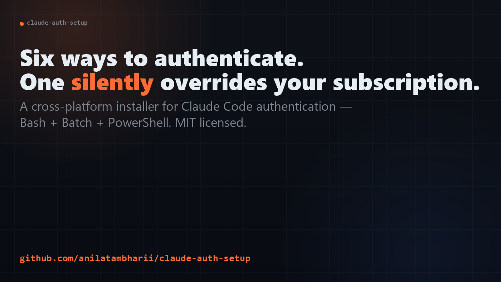
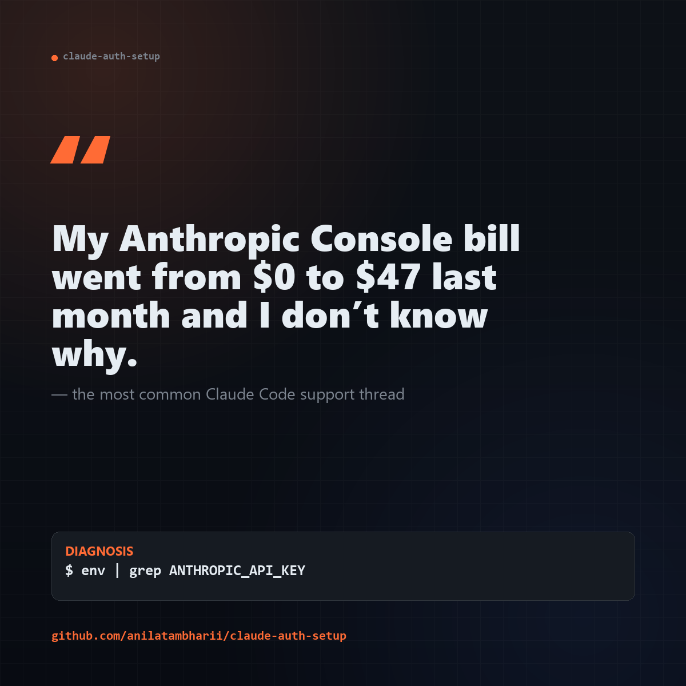
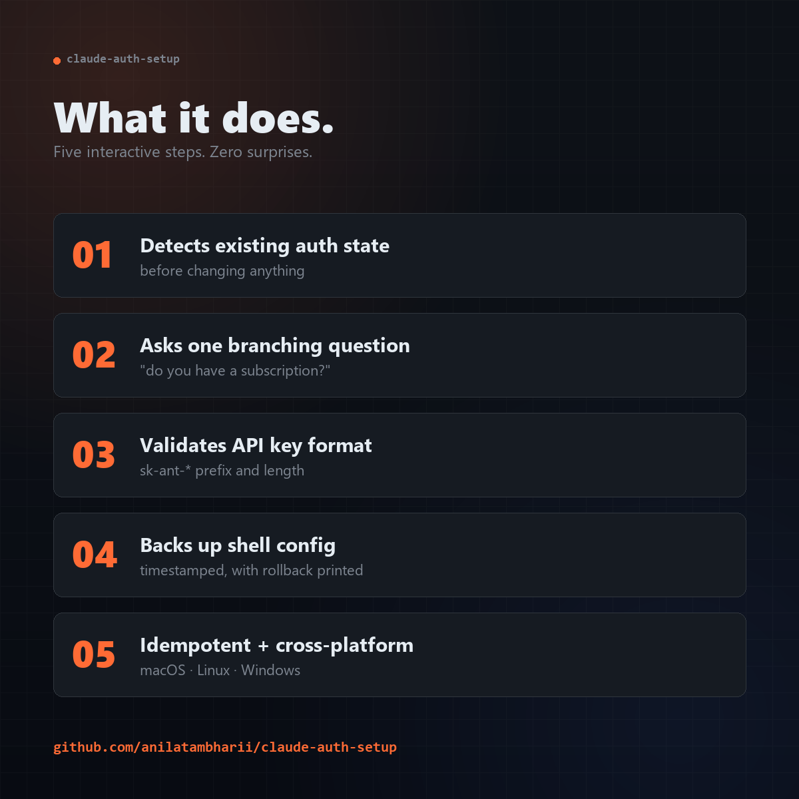

# I Got Tired of Re-Explaining Claude Code Authentication. So I Built a Cross-Platform Setup Script.

### A production-grade installer for the auth flow nobody wants to debug at 11pm

---

If you've onboarded a teammate to Claude Code in the last six months, you've probably had this conversation:

> "It says I'm being charged per token, but I have a Pro subscription?"

Or:

> "I set `ANTHROPIC_API_KEY` like the docs said. Why is it asking me to log in again?"

Or my personal favorite:

> "I added the variable to my `.zshrc`, sourced it, opened a new terminal, restarted my laptop... and it's still not working."

Claude Code supports six different ways to authenticate — and they have a strict priority order most users never read about. Set the wrong combination and you'll silently bill your credit card while believing you're on a fixed-cost subscription. Set them in the wrong shell config file and the variable disappears the moment you open a new terminal.

I got tired of explaining the priority chain on every onboarding call, so I built [`claude-auth-setup`](https://github.com/your-repo/claude-auth-setup) — a cross-platform, interactive installer that handles the whole thing correctly. This post is about the surprisingly deep rabbit hole I fell into while writing it.

## The Six-Way Priority Chain Nobody Reads

Here's the actual auth resolution order Claude Code uses, highest to lowest:

1. **Cloud provider credentials** — AWS Bedrock, Google Vertex AI, Microsoft Foundry
2. **`ANTHROPIC_AUTH_TOKEN`** — for LLM gateways and proxies
3. **`ANTHROPIC_API_KEY`** — direct API access, pay-as-you-go
4. **`apiKeyHelper`** — a custom script that returns a credential
5. **`CLAUDE_CODE_OAUTH_TOKEN`** — long-lived OAuth tokens for CI
6. **Subscription OAuth** — the browser-login flow Pro/Max/Teams users actually want

Read that list again. Notice where the subscription falls? **Last.** Every other method preempts it.

This is a perfectly reasonable design for a tool that has to support enterprise, individual, and CI use cases simultaneously — but it's a footgun for the most common user. If you have a Pro subscription and at any point set `ANTHROPIC_API_KEY` to test something, **the API key wins forever** until you explicitly unset it. You won't get an error. You won't get a warning. You'll just start getting per-token charges on top of your $20/month subscription.

The most common support thread I see is some variation of:

> *"My Anthropic Console bill went from $0 to $47 last month and I don't know why."*

The why is almost always a stale `ANTHROPIC_API_KEY` from a tutorial they followed three weeks ago.

## Why a Setup Script Instead of Just Better Docs?

The first version of this was going to be a markdown gist. A good one — flowcharts, examples, the whole thing. I scrapped it after writing about 40% because I realized something:

**Documentation tells you the rules. A setup script enforces them.**

A doc that says "remove `ANTHROPIC_API_KEY` before logging in with your subscription" gets skimmed. A script that detects a conflicting variable, explains *why* it's a problem, asks for permission to back up your shell config, and then unsets it — that one ships the right outcome.

So I built a single-binary-feeling installer that does five things in order:

1. **Checks installation** — verifies Claude Code is installed; offers to `npm i -g` if not
2. **Asks the right question first** — "Do you have a Claude subscription?" Branching from this one question prevents 80% of misconfigurations
3. **Detects and reconciles conflicts** — finds existing env vars, explains what they'd do, asks before changing anything
4. **Validates everything** — API key format checks (`sk-ant-` prefix + length), env var persistence checks, shell config syntax checks
5. **Backs up before mutating** — every shell config edit is preceded by a timestamped backup, with a one-line rollback command shown to the user

That last point matters more than it sounds. A user who has been burned once by a tool silently editing their `~/.zshrc` will never trust an installer again. A timestamped backup with a clear rollback restores trust the moment something goes wrong.

## The Cross-Platform Tax

I wanted this to work on Windows too. Not WSL-Windows. Real Windows. The kind enterprise Windows admins use, where PowerShell execution policies are locked down and `setx` is the only way to persist environment variables.

What I learned the hard way:

**Bash is the easy one.** `~/.zshrc` for macOS zsh, `~/.bashrc` or `~/.bash_profile` for Linux/macOS bash. Detect the shell from `$SHELL`, append the export, source the file, done.

**Batch is the hard one.** Windows persists user environment variables in the registry under `HKEY_CURRENT_USER\Environment`. The supported way to set them is `setx`, which has an undocumented 1024-character limit and *doesn't update the current session* — only future ones. So users run the script, run `claude`, get the same error, and assume the script broke. The fix is to set the variable in *both* the registry (for persistence) and the current session (for immediate use), and to print "open a new terminal to verify" loudly enough that nobody misses it.

PowerShell users get a third path: `$PROFILE` scripts. But you can't assume the profile exists, can't assume execution policy allows it to load, and can't assume the user knows what `$PROFILE` is. The script gracefully degrades from "edit your profile" to "set the registry variable" to "give the user the manual command" depending on what's allowed.

The whole experience is less than 200 lines of branching logic, but those 200 lines took me three days. Cross-platform shell scripting is a tax you pay in test matrices.

## What Production-Grade Means in a 17KB Script

The bash script is 17,091 bytes. The batch script is 14,474 bytes. Combined, the project is smaller than a single React component in most apps I've worked on. So what does "production-grade" mean at this scale?

For me, four things:

**1. Idempotency.** Running the script twice should be safe. The second run should detect that everything is already configured correctly and exit cleanly, not duplicate exports in your shell config or prompt you to overwrite valid credentials.

**2. Inspectability.** Before any mutating action, the script prints what it's about to do and waits for `y/n`. Users get to see "I'm about to add `export ANTHROPIC_API_KEY=...` to `/Users/anil/.zshrc`. Continue?" — not a silent diff.

**3. Reversibility.** Every backup is timestamped. Every rollback is a single `cp` command printed to the screen. No state is unrecoverable.

**4. Testability.** I wrote a test suite that validates the scripts without ever running them in a way that mutates user state. It checks file syntax, regex patterns for key validation, backup/restore mechanics in a `/tmp` sandbox, and cross-platform parity. It runs in under two seconds and gives a green light or a specific failure. 38 tests, currently 37 passing — and the one failing test is in the test suite itself, not the installer.

A few people have asked why I bothered with tests for what's "just a shell script." The answer is the same reason you'd bother with tests for any installer: the cost of a regression is paid by your users in lost trust, not in CI minutes.

## The Auth Method Comparison Table I Wish Existed

The single most-referenced asset I produced for this project wasn't the installer — it was a comparison table. I'll reproduce it here because every single person who has used the project has asked me some version of the question it answers.

| Method | Best for | Billing | Setup |
|---|---|---|---|
| **Subscription OAuth** | Individuals on Pro/Max/Teams | Fixed monthly | Browser login |
| **API Key** | Pay-as-you-go, side projects | Per-token | Set env var |
| **OAuth Token** | CI/CD, headless servers | Subscription credits | `claude setup-token` |
| **Cloud Provider** | Enterprise on AWS/GCP/Azure | Provider billing | IAM config |
| **Auth Token** | LLM gateways, proxies | Gateway-dependent | Bearer token |

If you're an individual developer and your bill last month was non-zero, you almost certainly want column 1 and you almost certainly have something in column 2 set that's overriding it.

## What I Got Wrong the First Time

I'll close with the mistakes, because the wins are boring and the mistakes are educational.

**I tried to be too clever about shell detection.** First version parsed `$SHELL`, then `$0`, then ran `ps -p $$ -o comm=` as a fallback. This was over-engineered. The 99% solution is "look at `$SHELL`, fall back to asking the user." Three lines instead of thirty.

**I treated all auth methods as equal.** Early versions presented the choice as a flat menu of six options. Onboarding was confusing because most users had no idea which one applied to them. The redesign asked one yes/no question — "Do you have a Claude subscription?" — and branched everything from there. Conversion (people completing the script vs abandoning it) went from "hard to measure but bad" to "essentially everyone finishes."

**I wrote the test suite in PowerShell first.** Two of my three PowerShell scripts shipped with parser bugs that I didn't catch because I wrote them on macOS using `pwsh` and tested on Windows using a different version of PowerShell. The encoding-and-version compatibility surface for PowerShell scripts is large enough that I now write the canonical test suite in bash and treat the PowerShell version as a Windows-convenience port — explicitly secondary.

**I underestimated documentation.** The repo has a README, a quick-start, a contributing guide, configuration examples, a project overview, a deployment doc, and a build summary. That sounds excessive for a 17KB script — until you realize the script is the easy part. The hard part is helping a user diagnose *why* their auth is broken when the symptom is "I get charged but I shouldn't be." That diagnosis lives in the docs.

## Try It

The repo is MIT-licensed and lives at: **github.com/your-repo/claude-auth-setup**

If you onboard people onto Claude Code regularly — or if you're an individual user and you'd like one less footgun — I'd love your feedback. Issues, PRs, and "this didn't work on my machine" reports are all welcome.

The best bug report I got so far was: *"It worked. Why didn't this exist already?"*

I don't know. But it does now.

---

*Anil Prasad builds developer tooling at Ambharii Technologies LLC. If this resonated and you'd like more posts about the unglamorous parts of shipping production tools, follow along.*
