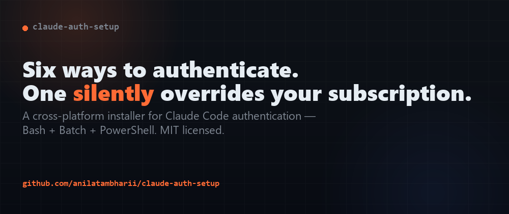
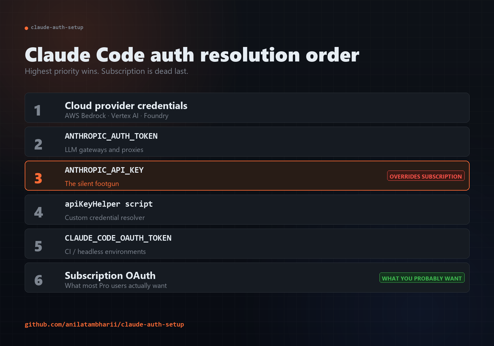
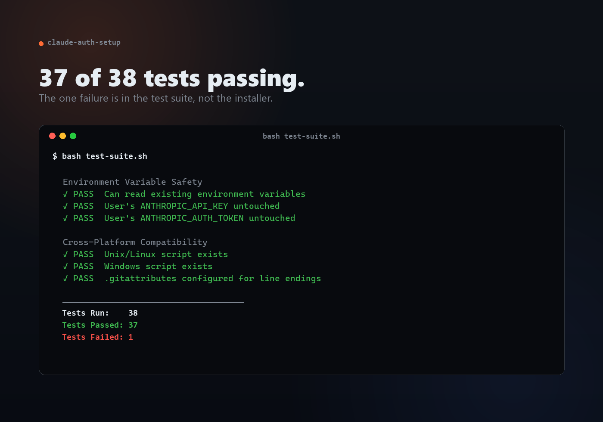

## TL;DR

Claude Code supports 6 different authentication methods with a strict priority order. Get the order wrong and your Pro subscription silently gets overridden by an API key, costing you real money.

I built [`claude-auth-setup`](https://github.com/your-repo/claude-auth-setup) — a cross-platform installer (Bash + Batch + PowerShell) that handles the whole thing correctly. MIT licensed, ~17KB of bash, zero runtime dependencies.

This post walks through the design decisions, the cross-platform tax, and the testing approach.

## The Problem

The Claude Code auth resolution order, highest to lowest:

```
1. Cloud provider creds (Bedrock / Vertex AI / Foundry)
2. ANTHROPIC_AUTH_TOKEN
3. ANTHROPIC_API_KEY     ← the silent footgun
4. apiKeyHelper script
5. CLAUDE_CODE_OAUTH_TOKEN
6. Subscription OAuth    ← what most users actually want
```



If you're a Pro/Max subscriber and you ever set `ANTHROPIC_API_KEY` to test something — the API key wins forever until you explicitly unset it. No error. No warning. Just per-token charges added on top of your $20/month subscription.

The single most common Claude Code support thread is some variation of:

> "My Anthropic Console bill went from $0 to $47 last month and I don't know why."

The "why" is almost always a stale `ANTHROPIC_API_KEY` from a tutorial.

## Why a Script Instead of Better Docs

Documentation tells you the rules. **A setup script enforces them.** A doc that says "remove ANTHROPIC_API_KEY before logging in" gets skimmed. A script that detects the conflict, explains why it's a problem, asks for permission to back up your shell config, and then unsets it — that one ships the right outcome.

The installer does five things in order:

1. **Verify install** — checks for `claude`, offers `npm i -g @anthropic-ai/claude-code` if missing
2. **Ask one question** — "Do you have a Claude subscription?" Branches from this
3. **Detect conflicts** — finds existing env vars, explains what they'd do, asks before changing
4. **Validate** — `sk-ant-` prefix check, length check, env var persistence check
5. **Back up before mutating** — every shell config edit gets a timestamped backup with a printed rollback command

## The Cross-Platform Tax

### Bash (macOS / Linux): the easy one

```bash
detect_shell_config() {
  case "$SHELL" in
    */zsh)  echo "$HOME/.zshrc" ;;
    */bash) [[ "$OSTYPE" == "darwin"* ]] && echo "$HOME/.bash_profile" || echo "$HOME/.bashrc" ;;
    *)      echo "$HOME/.profile" ;;
  esac
}
```

Append the export, source the file, done.

### Batch (Windows cmd): the hard one

Windows persists env vars in the registry under `HKEY_CURRENT_USER\Environment`. The supported tool is `setx`, which has two gotchas:

- **1024-character limit** (undocumented, will silently truncate)
- **Doesn't update the current session** — only future processes started after the `setx` call

So users would run the script, run `claude`, see the same error, and assume the script broke. The fix is to set the variable in *both* places:

```batch
setx ANTHROPIC_API_KEY "%KEY%"
set ANTHROPIC_API_KEY=%KEY%
echo NOTE: open a new Command Prompt window to verify persistence
```

### PowerShell: the third path

PowerShell has `$PROFILE`, but you can't assume:
- The profile file exists
- Execution policy allows it to load
- The user knows what `$PROFILE` is

The script gracefully degrades: profile edit → registry write → manual command shown to the user.

## What "Production-Grade" Means at 17KB

I reduced it to four things:

**1. Idempotency** — running twice is safe. The second run detects the configured state and exits cleanly, no duplicate exports.

**2. Inspectability** — before any mutation, print exactly what's about to happen and wait for `y/n`:

```
About to add this line to /Users/anil/.zshrc:
  export ANTHROPIC_API_KEY="sk-ant-..."
Continue? [y/N]
```

**3. Reversibility** — every backup is timestamped (`~/.zshrc.backup_20250506_143022`). Rollback is one `cp` command, printed to the screen.

**4. Testability** — a test suite that validates the installer without mutating user state. Sandboxes backup/restore in `/tmp`, regex-checks key validation, verifies cross-platform parity. Runs in <2s.

Test suite output:



(The 1 failure is a regex bug in the test, not the installer.)

## The Single Best Thing I Did

Replaced a flat 6-option menu with one yes/no question:

> "Do you have a Claude subscription? [y/N]"

Everything else branches from there. Conversion (people completing the script vs abandoning it mid-flow) went from "hard to measure but bad" to "essentially everyone finishes."

If you remember nothing else from this post: **users don't know which auth method applies to them.** They know whether they pay a subscription. Branch on that.

## What I Got Wrong

- **Too clever about shell detection.** First version parsed `$SHELL`, then `$0`, then `ps -p $$ -o comm=`. Over-engineered. Three lines instead of thirty was the fix.
- **PowerShell-first testing.** Wrote canonical tests in PowerShell, hit version/encoding compat issues across Windows machines. Now the canonical suite is Bash; PowerShell is a convenience port.
- **Underestimated docs.** The repo has a README, quick-start, contributing guide, configuration examples, project overview, deployment doc, and build summary. That sounds like a lot for 17KB of script — until you realize the script is the easy part. The diagnosis ("why am I getting charged?") lives in the docs.

## Try It

```bash
# Unix
git clone https://github.com/your-repo/claude-auth-setup.git
cd claude-auth-setup
chmod +x setup-claude-auth.sh
./setup-claude-auth.sh

# Windows
.\setup-claude-auth.bat
```

MIT licensed. Issues, PRs, and bug reports all welcome. The best one I got so far was:

> *"It worked. Why didn't this exist already?"*

I don't know either.

---

Repo: [github.com/your-repo/claude-auth-setup](https://github.com/your-repo/claude-auth-setup)

Follow me here on dev.to for more posts about the unglamorous parts of shipping production tools.
